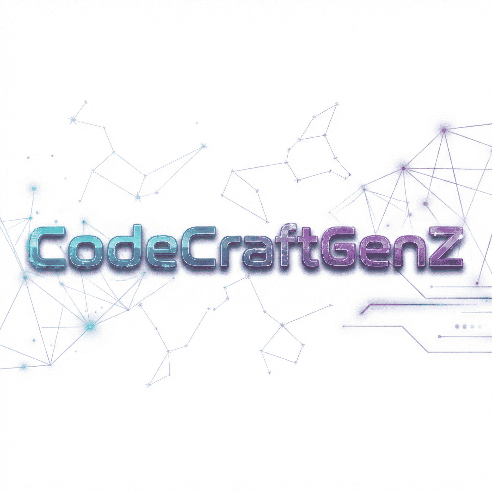

<p align="center">
  
</p>

<h1 align="center">FidelCraft</h1>

<p align="center">
  <strong>Plataforma de fidelidade digital para comercios locais - pontos, carimbos e cashback</strong>
</p>

<p align="center">
  
  
  
  
  
</p>

---

## Sobre

FidelCraft e uma plataforma SaaS de programas de fidelidade digital para comercios locais. Substitui o cartao fidelidade de papel por uma experiencia digital com QR code, PWA e analytics em tempo real.

**Destaques:**
- 3 tipos de programa: Pontos, Carimbos e Cashback
- QR Code para acumular pontos em segundos
- Niveis (Bronze/Prata/Ouro/Diamante) com multiplicadores
- Campanhas (pontos em dobro, aniversario, indicacao)
- Dashboard do cliente via PWA (sem app store)
- Funcionarios com PIN para registrar transacoes

## Stack

| Camada | Tecnologia |
|--------|-----------|
| Backend | NestJS 10, TypeScript 5.7, Prisma 6, MySQL 8 |
| Frontend | React 18, Vite 6, TailwindCSS 3.4, TanStack Query 5 |
| Pagamentos | Mercado Pago SDK (PIX + Cartao) |
| Storage | Cloudflare R2 |
| Auth | JWT + Google OAuth + 2FA (TOTP) |
| Email | Nodemailer (SMTP) |
| Push | Web Push API (VAPID) |
| Infra | Docker, PM2, GitHub Actions |

## Quick Start

```bash
# Instalar dependencias
npm install

# Subir MySQL
make up-db

# Rodar migrations
make db-migrate

# Seed (dados de teste)
make db-seed

# Iniciar (backend + frontend)
make dev
```

**Acesse:** http://localhost:5174

**Credenciais de teste:**
- Admin: `admin@fidelcraft.com` / `Admin123!`
- Demo: `demo@fidelcraft.com` / `Demo1234!`
- Loja demo: `/l/cafe-do-joao`

## Modulos

| Modulo | Descricao | Endpoints |
|--------|-----------|-----------|
| Auth | JWT, Google OAuth, 2FA, password reset | 11 |
| Users | CRUD, perfil | 2 |
| Stores | Lojas, slug, pagina publica | 5 |
| Programs | Programas (POINTS/STAMPS/CASHBACK) | 6 |
| Members | Cadastro QR, magic link, dashboard | 7 |
| Transactions | Earn/redeem/expire pontos, CRON | 5 |
| Rewards | Premios, resgate, estoque | 7 |
| Campaigns | Pontos em dobro, aniversario, sazonais | 5 |
| Tiers | Bronze/Prata/Ouro/Diamante | 4 |
| Payments | Mercado Pago, planos, webhooks | 4 |
| Notifications | Web Push, in-app | 6 |
| Analytics | Dashboard, engajamento, top members | 7 |
| Organizations | Multi-loja B2B | 9 |
| Staff | Funcionarios com PIN | 6 |

**Total: ~84 endpoints**

## Planos

| Plano | Preco | Limites |
|-------|-------|---------|
| Free | R$0 | 1 loja, 1 programa, 50 membros |
| Pro | R$49/mes | 3 programas, 500 membros, campanhas |
| Business | R$99/mes | 3 lojas, 2000 membros, 10 funcionarios |
| Enterprise | R$199/mes | Ilimitado, API, whitelabel |

## Estrutura

```
FidelCraft/
├── backend/          # NestJS API
│   ├── src/          # 17 modulos
│   └── prisma/       # Schema + migrations + seed
├── frontend/         # React SPA
│   └── src/          # 12 paginas + componentes
├── infra/            # Docker MySQL
└── scripts/          # Deploy
```

---

<p align="center">
  Desenvolvido por <strong>CodeCraftGenZ</strong>
</p>
